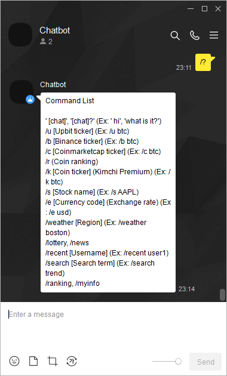
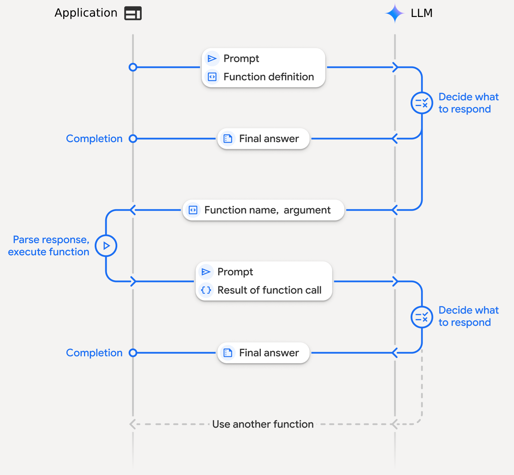
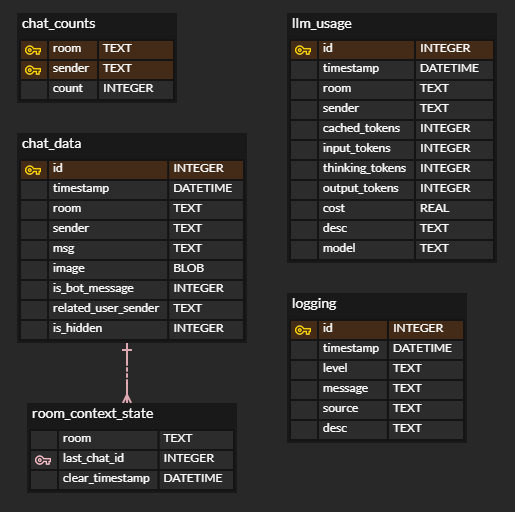

# LLM-Powered AI Agent

# Summary

 

Developed a multi-functional AI agent that runs on the messenger KakaoTalk, leveraging LLMs. The project showcases prompt engineering and dynamic function-calling capabilities, enabling the agent to interact with a wide range of external APIs in real-time.

- Core Engine: Utilizes OpenAI-compatible LLM API for natural language understanding, reasoning, and response generation.
- Agentic Behavior: Implements a dynamic function-calling architecture where the LLM determines which external API to call based on user queries.
- Diverse Integrations: Connects to APIs for real-time data, including financial markets (crypto/stocks), news headlines, web search, weather, and more.
- Data Persistence: Constructs a local database to manage conversation history, user statistics, internal logging, and detailed LLM token/cost tracking.

# Project

## Overall Architecture

The agent follows a reason-and-act cycle. This allows it to dynamically access and process external information, like real-time information, providing answers that go beyond its pre-trained knowledge.

>  
> The core process:
> 1. User Input: The agent receives a message from a user in a KakaoTalk chat room.
> 2. Reasoning (1st LLM Call): The message, along with conversation history and a system prompt, is sent to the LLM. The model analyzes the request and decides on a course of action. This can either be a direct text response or a `function calling` requesting data from an external source.
> 3. Execute Function: If the LLM requests a function call, the agent executes the corresponding internal function (e.g., `getSecurityInfo()`, `getSearchResults()`).
> 4. Create Response (2nd LLM Call): The data returned from the tool is formatted and sent back to the LLM as part of the ongoing conversation. The model then synthesizes this new information to formulate a final, user-friendly response.
> 5. Final Response: The bot sends the generated message back to the user.

## Database

A local database ensures data persistence and allows the agent to leverage previous conversations.

>  
> Database Structure
> - `chat_data`: Stores a complete log of all conversations, including text, images, and sender information, forming the basis for the LLM's context.
> - `llm_usage`: Meticulously tracks every LLM API call, recording input/output/thinking tokens and calculating the approximate cost. This is crucial for monitoring and optimization.
> - `room_context_state`: Manages conversational context, allowing for manual resets to prevent context drift and control costs.
> - `chat_counts` & `logging`: Handle user engagement statistics and internal system logs for debugging.