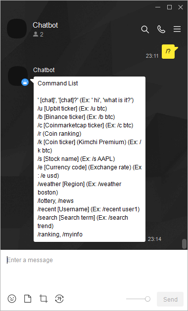
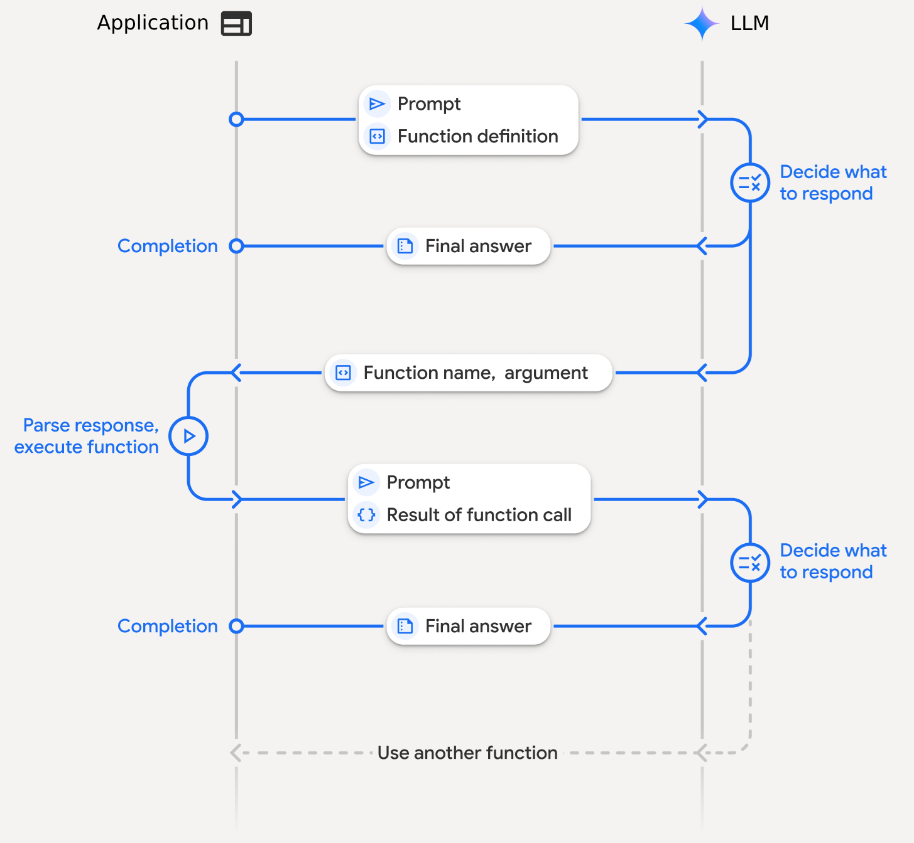
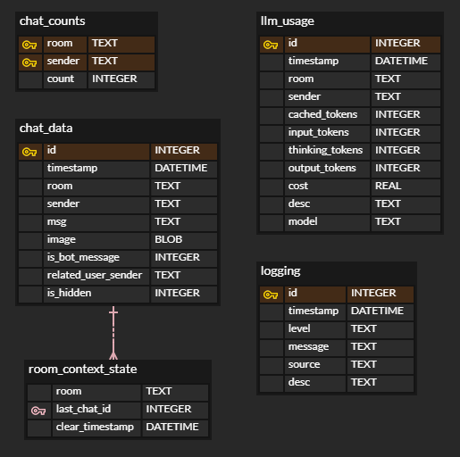

# LLM 기반 AI 에이전트

# Summary

 

- 자연어 이해, 추론 및 응답 생성을 위해 OpenAI 호환 LLM API 활용.
- LLM이 사용자 요청에 필요한 외부 API를 호출하는 동적 함수 호출 아키텍처 구현.
- 금융 시장(암호화폐/주식), 뉴스 헤드라인, 웹 검색, 날씨 등 LLM이 동적 호출 가능한 모듈 개발.
- 로컬 데이터베이스를 사용하여 대화 기록, 사용자 통계, 내부 로깅, LLM 토큰/비용 추적, 관리.

카카오톡에서 동작하는 LLM기반 AI 에이전트. 프롬프트 엔지니어링과 동적 함수 호출을 통해, 에이전트는 사용자의 요청에 필요한 외부 API를 사용하여 응답을 생성합니다.

# Project

## Overall Architecture

에이전트는 추론-행동 주기로 작동합니다. 이를 통해 외부 정보에 동적으로 접근하고 처리하여, 실시간 정보 등 사전 훈련된 지식을 뛰어넘는 답변을 제공합니다.

>  
> 에이전트 작동 방식:
> 1. 메세지 수신: 카카오톡 채팅방에서 사용자로부터 메시지를 수신합니다.
> 2. 추론 (1차 LLM 호출): 메시지는 이전 대화 기록 및 시스템 프롬프트와 함께 LLM으로 전송됩니다. 모델은 요청을 분석하고 행동 방침을 결정합니다. 이는 직접적인 텍스트 응답이거나 외부 소스에서 데이터를 요청하는 `함수 호출`일 수 있습니다.
> 3. 함수 실행: LLM이 함수 호출을 요청하면, 에이전트는 해당하는 함수(예: `getSecurityInfo()`, `getSearchResults()`)를 실행합니다.
> 4. 응답 생성 (2차 LLM 호출): 도구에서 반환된 데이터는 형식화되어 진행 중인 대화의 일부로 LLM에 다시 전송됩니다. 모델은 이 새로운 정보를 통합하여 최종적인, 사용자 친화적 응답을 생성합니다.
> 5. 최종 응답: 봇은 생성된 메시지를 사용자에게 전송합니다.

## Database

로컬 데이터베이스를 통해, 데이터 지속성을 보장하고 에이전트가 이전 대화 내용을 활용할 수 있도록 합니다.

>  
> 데이터베이스 구조
> - `chat_data`: 모든 대화의 전체 로그(텍스트, 이미지, 발신자 정보 포함)를 저장하며, LLM의 컨텍스트 기반을 형성합니다.
> - `llm_usage`: 모든 LLM API 호출을 추적하여 입력/출력/사고 토큰을 기록하고 비용을 계산합니다. 이는 모니터링 및 최적화에 사용됩니다.
> - `room_context_state`: 대화 컨텍스트를 관리하여, 재설정을 가능하게 합니다..
> - `chat_counts` & `logging`: 사용자 참여 통계 및 디버깅을 위한 내부 시스템 로그를 처리합니다.
