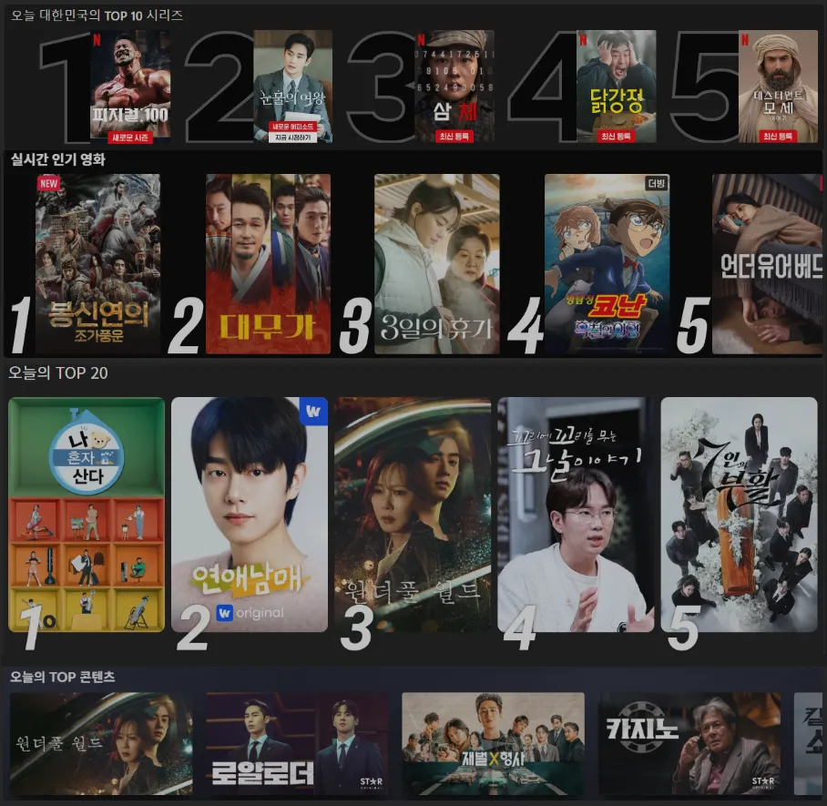
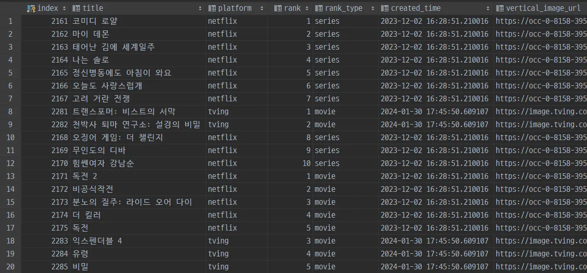

# Integrated OTT Content Ranking Platform

# Summary

- Crawled daily content rankings from major streaming platforms: Netflix, TVING, Wavve, and Disney+.
- Generated integrated content rankings by combining collected ranking data with internet viral metrics.

Utilized internal service APIs for crawling to minimize impact from web UI changes.
Implemented a virtual browser-based backup plan to prevent service disruptions due to API structural changes or other issues.

# Project Details

## DB Structure

>  
> Database Structure
> - `ott_rank`: Collected OTT rankings and metadata.
> - `summarized_ranking`: Integrated content rankings.
> - `ranking_weight`: Daily mention counts per content item.
> - `uni_meta`: Metadata from internet posts.
> - `uni_keywords`: Keywords mentioned within posts.

Integrated content rankings are generated based on rankings collected from each OTT platform and their mention counts in internet posts.
Mention counts per content item and integrated content rankings are automatically calculated daily via SQL queries.

## Crawling Results

>  
> Original data on the web page.

>  
> Collected and stored ranking data.

Implemented data collection methods using both direct REST API calls and Selenium-based virtual browsers.