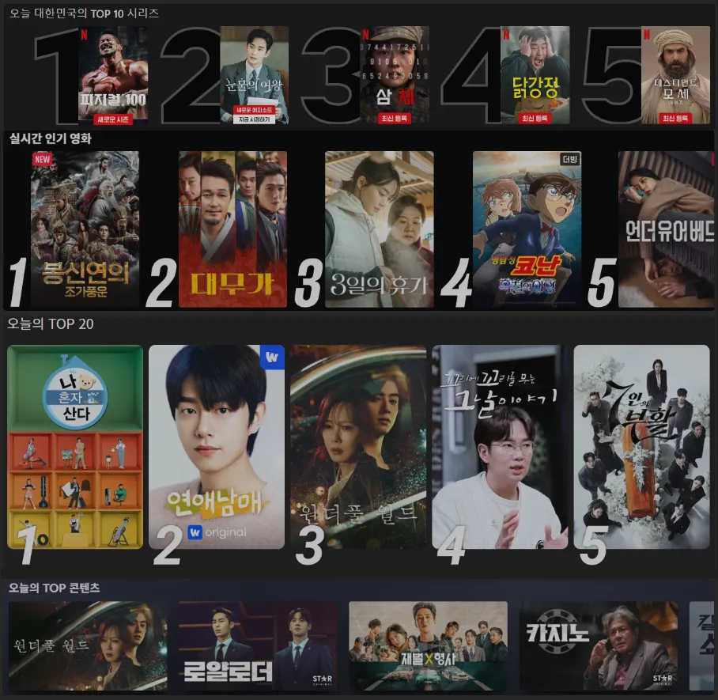
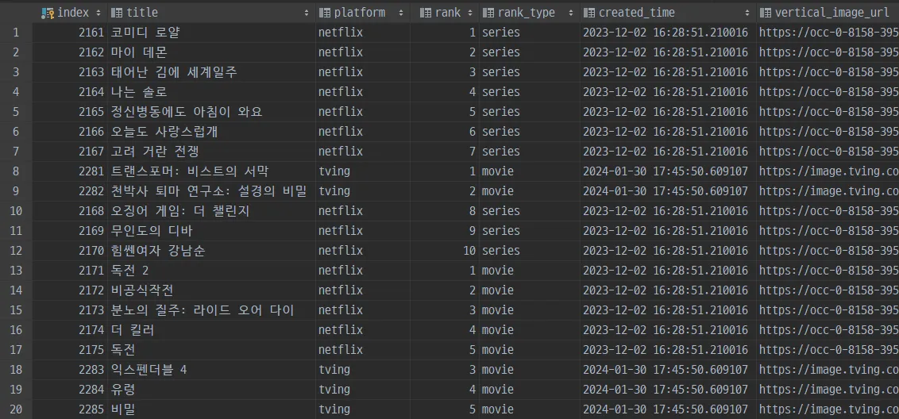

# 통합 OTT 컨텐츠 순위 제작

# Summary

- Netflix, TVING, Wavve, Disney+의 컨텐츠 일간 순위 크롤링
- 수집된 순위 데이터와 인터넷 언급량 데이터를 기반으로 통합 컨텐츠 순위 제작

크롤링시 서비스 내부 API를 활용하여 웹페이지 UI 변경시의 영향을 최소화.  
API 구조 변경 등으로 인한 프로그램 동작 장애를 방지하기 위해 가상 브라우저방식의 백업플랜 구현.  

# Project

## DB Structure

>  
> 데이터베이스 구조  
> - `ott_rank`: 수집된 OTT 순위, 메타데이터
> - `summarized_ranking`: 통합 컨텐츠 순위
> - `ranking_weight`: 컨텐츠별 일간 언급횟수
> - `uni_meta`: 인터넷 게시물 메타데이터
> - `uni_keywords`: 게시물내 언급된 카워드

각 OTT 플랫폼에서 수집된 순위와 인터넷 게시물들에서 언급된 횟수를 기반으로 통합 컨텐츠 순위 제작.  
컨텐츠별 언급횟수, 통합 컨텐 순위는 SQL 쿼리를 통해 매일 자동으로 계산됨.

## Crawling Result

>  
> 웹 페이지 상의 원본 데이터

>  
> 수집, 저장된 순위 데이터

REST API 호출을 통한 방식, selenium 가상 브라우저를 사용한 방식 모두 구현