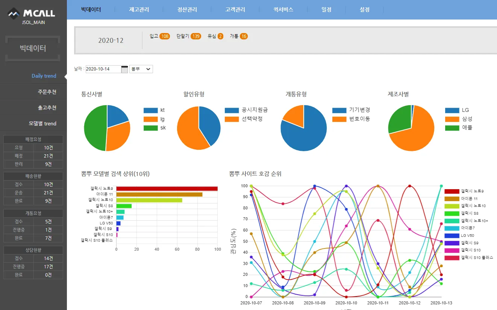

# Smartphone Order Recommendation Model

# Summary

 

- Crawled posts in real-time from online mobile phone communities.
- Preprocessed collected posts, extracted key keywords, and created an interactive visualization dashboard.
- Analyzed product and activation type preferences based on keyword trends to recommend optimal smartphone orders.

# Project Details

## DB Structure

>  
> Database Structure
> - `tb_article`: Data from mobile phone community posts.
> - `tb_article_keyword`: Device information and keywords mentioned in posts.
> - `tb_search_trend_data`: Trend data from Google, Naver, and YouTube.
> - `tb_phone_model`: List of phone models tracked for mentions and search trends.
> - `tb_phone`: List of all handled/stocked phone models.

## Details

Crawled posts from mobile phone communities, then extracted and stored relevant phone-related keywords.
Collected Google, Naver, and YouTube trend data for each phone model.
Developed a dashboard to visualize phone activation trends based on the collected data, providing insights for inventory management.