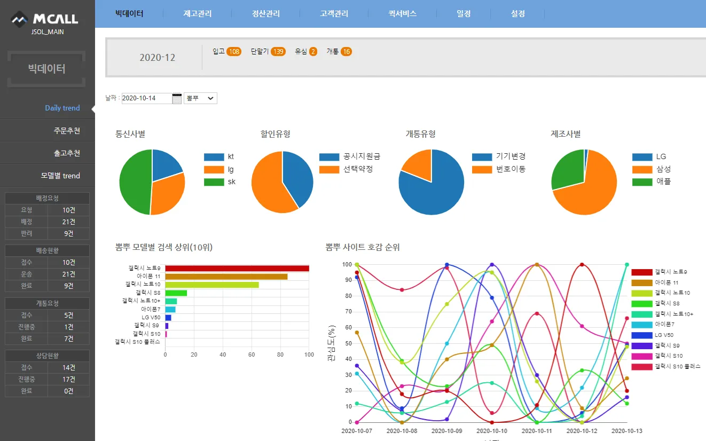

# 스마트폰 발주 추천모델 구축

# Summary

 

- 핸드폰 커뮤니티들의 게시물 실시간 크롤링
- 수집된 게시물 전처리, 주요 키워드 추출후 시각화 대시보드 제작
- 주요 키워드를 바탕으로 기반 제품, 개통유형별 선호도 분석, 모델 발주 추천

# Project

## DB Structure

>  
> 데이터베이스 구조  
> - `tb_article`: 핸드폰 커뮤니티 게시물 데이터
> - `tb_article_keyword`: 게시물에서 언급된 기기 정보
> - `tb_search_trend_data`: Google, Naver, Youtube 트렌드 정보
> - `tb_phone_model`: 언급량, 트렌드 검색 대상 핸드폰 모델 리스트
> - `tb_phone`: 취급중인 모든 핸드폰 리스트

## Details

핸드폰 커뮤니티 게시물 크롤링, 게시물에서 언급된 핸드폰 관련 키워드 추출, 저장  
핸드폰 모델별 구글, 네이버, 유튜브 트렌드 수집  
수집된 데이터를 바탕으로 핸드폰 개통 트렌드 대시보드 제작